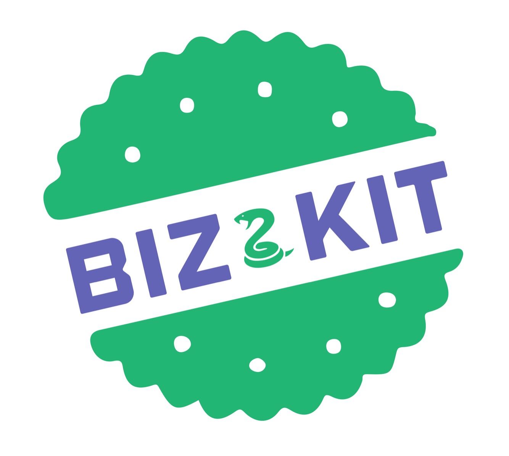

# 

# bizkit

bizkit is a Python package to help streamlining business analytics data mining tasks. This package provides methods for market basket analysis, anomaly detection, customer survival analysis, customer clustering, and uplifting analysis. Implemented algorithms include mlxtend.apriori, sklearn.IsolationForest, lifelines.KaplanMeierFitter, [], and []. bizkit focuses on ease of use by providing a well-documented and consistent interface. The results are visualized via bokeh library, d3fgraph library, and [].

# Reference

Market basket analysis:
- Introduction to Market Basket Analysis in Python https://pbpython.com/market-basket-analysis.html
- A Gentle Introduction on Market Basket Analysis — Association Rules https://towardsdatascience.com/a-gentle-introduction-on-market-basket-analysis-association-rules-fa4b986a40ce

Anomaly detection:
- Anomaly Detection Principles and Algorithms (2017) by Kishan G. Mehrotra, Chilukuri K. Mohan, HuaMing Huang
- Sklearn IsolationForest: https://scikit-learn.org/stable/modules/generated/sklearn.ensemble.IsolationForest.html

Customer survival analysis:
- Lifelines https://lifelines.readthedocs.io/en/latest/

Customer clustering:
- to add

Uplifting analysis:
- to add

